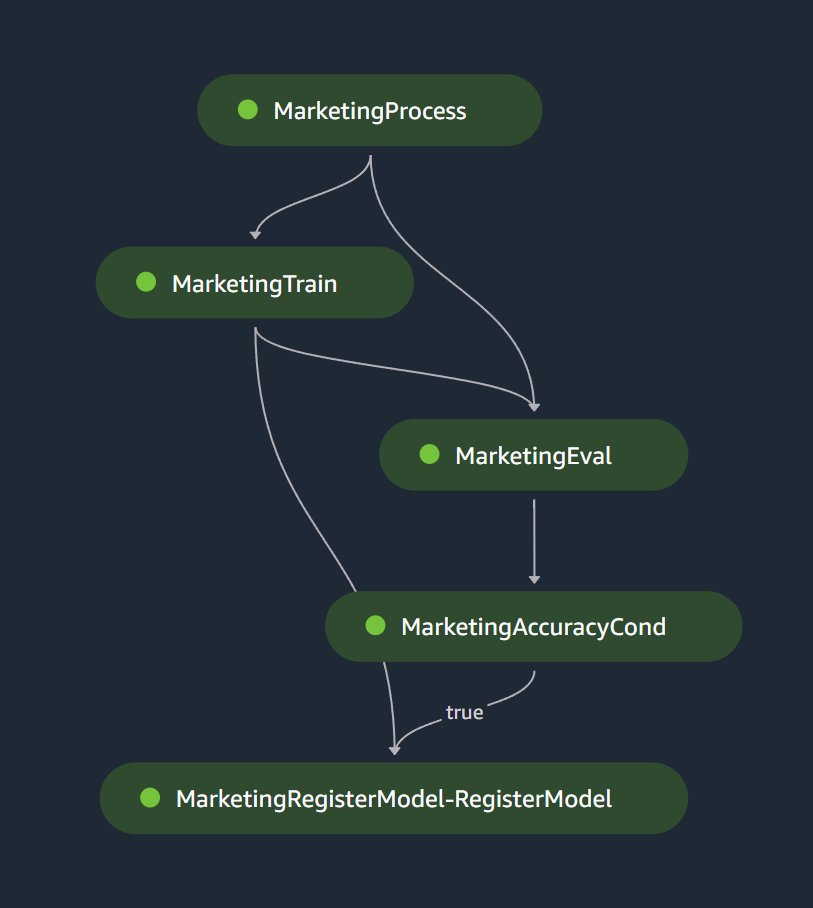

# Get started with SageMaker Pipelines

## Introduction
Amazon SageMaker Model Building Pipelines is a tool for building machine learning pipelines that take advantage of direct SageMaker integration. In this tutorial, you will assume the role of a machine learning developer working at a bank. You have been asked to develop a machine learning model to predict whether a customer will enroll for a certificate of deposit (CD). The model will be trained on the marketing dataset that contains information on customer demographics, responses to marketing events, and external factors.

## Goals
This example notebook will help you create a pipeline that consists of the following steps: Processing, Training, Model Evaluation, Register Model and Condition Steps. Successfull completed pipeline looks like the below:

## Reference Next Steps

[Orchestrate Jobs to Train and Evaluate Models with Amazon SageMaker Pipelines](https://sagemaker-examples.readthedocs.io/en/latest/sagemaker-pipelines/tabular/abalone_build_train_deploy/sagemaker-pipelines-preprocess-train-evaluate-batch-transform.html)
[Parameterize SageMaker Pipelines](https://sagemaker-examples.readthedocs.io/en/latest/sagemaker-pipeline-parameterization/parameterized-pipeline.html)
[Multi-model SageMaker Pipeline with Hyperparamater Tuning and Experiments](https://sagemaker-examples.readthedocs.io/en/latest/sagemaker-pipeline-multi-model/restate-project.html)
[Comparing model metrics with SageMaker Pipelines and SageMaker Model Registry](https://sagemaker-examples.readthedocs.io/en/latest/sagemaker-pipeline-compare-model-versions/notebook.html)